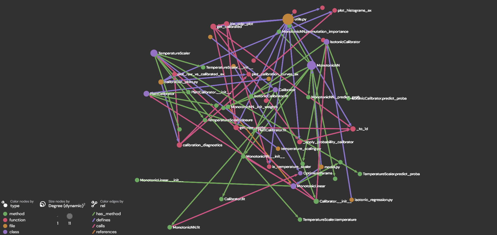

# Unit tests generator with GraphRAG and LLM
This repository ...

## Table of Contents

1. [Graph structure](#graph-structure)
2. [Use cases](#use-cases)
3. [Code Quality & Documentation](#code-quality--documentation)
    - [Pre-commit Hooks](#pre-commit-hooks)
    - [Unit Testing](#unit-testing)
    - [Peer Review](#peer-review)
4. [Virtual Environment](#virtual-environment)
    - [Create a new virtualenv with the project's dependencies](#create-a-new-virtualenv-with-the-projects-dependencies)
    - [Checking if the project's virtual environment is active](#checking-if-the-projects-virtual-environment-is-active)
    - [Updating the project's dependencies](#updating-the-projects-dependencies)
5. [TODO](#todo)

## Graph structure
To extract relevant context, the graph needs:

### 🟢 Nodes for:
- Files
- Classes
- Functions
- Methods

Fields:
- id: canonical ID (e.g., file::...::class::Calibrator / ...::method::Calibrator.fit)
- type: "file" | "class" | "method" | "function"
- name: symbol name ("Calibrator", "fit", etc.)
- file: file path
- signature: normalized function/method signature "def fit(self, probs, y) -> None"
- docstring: (trimmed) docstring
- source: actual source code of the node

### ➡️ Edges for:
- "defines" (file → symbol)
- "has_method" (class → method)
- "calls" (function/method → called symbol)
- "references" (function/method → referenced symbol)

Fields:
- src: source node id
- dst: destination node id
- rel: "defines" | "has_method" | "references" | "calls"

### 🧠 Prompt template
TBD

## Use cases
Upload `repo.graphml` to https://lite.gephi.org/.

- Example for repository https://github.com/ArnauFabregat/probability_estimation


## Code Quality & Documentation
### Pre-commit Hooks
---
This project uses [pre-commit](https://pre-commit.com/) hooks to enforce code quality standards automatically before each commit. The following hooks are configured:

- **Formatting & File Integrity**: `trailing-whitespace`, `end-of-file-fixer`, `check-yaml`, `check-toml`
- **Code Linting & Formatting**: `ruff-check`, `ruff-format`
- **Type Checking**: `mypy`

Pre-commit hooks are automatically installed during virtual environment setup (`uv sync`).
- To run them for modified (staged) files:
    ```bash
    uv run pre-commit run
    ```
- To run them for the entire repository:
    ```bash
    uv run pre-commit run --all-files
    ```

### Unit Testing
---
Unit tests ensure code reliability and prevent regressions. Tests are written using pytest and should cover critical functionality.

To run all tests:
```bash
uv run pytest
```

To run tests with coverage:
```bash
uv run pytest --cov
```

### Peer Review
---
All code contributions are subject to peer review. Detailed review guidelines and standards are documented in the project's peer review guidelines document.

TBD

## Virtual Environment
### Create a new virtualenv with the project's dependencies
---
Install the project's virtual environment and set it as your project's Python interpreter.
This will also install the project's current dependencies.

Open a terminal in VSCode, then execute the following commands:

1. Install [UV: Python package and project manager](https://docs.astral.sh/uv/getting-started/installation/):
    * On Mac OSX / Linux: `curl -LsSf https://astral.sh/uv/install.sh | sh`
    * On Windows [In Powershell]: `powershell -ExecutionPolicy ByPass -c "irm https://astral.sh/uv/install.ps1 | iex"`

2. [optional] To create virtual environment from scratch with `uv`: [Working on projects](https://docs.astral.sh/uv/guides/projects/)

3. If the environment already exists, install the virtual environment. It will be installed in the project's root, under a new directory named `.venv`:
    * `uv sync`
    * `uv sync --group dev --group dashboard --group test` to install all the dependency groups

4. Activate the new virtual environment:
    * On Mac OSX / Linux: `source .venv/bin/activate`
    * On Windows [In Powershell]: `.venv\Scripts\activate`

5. Configure / install pre-commit hooks:
    * [Pre-commit](https://pre-commit.com/) is a tool that helps us keep the repository complying with certain formatting and style standards, using the `hooks` configured in the `.pre-commit-config.yaml` file.
    * Previously installed with `uv sync`.

### Checking if the project's virtual environment is active
---
All commands listed here assume the project's virtual env is active.

To ensure so, execute the following command, and ensure it points to: `{project_root}/.venv/bin/python`:
* On Mac OSX / Linux: `which python`
* On Windows / Mac OSX / Linux: `python -c "import sys; import os; print(os.path.abspath(sys.executable))"`

If not active, execute the following to activate:
* On Mac OSX / Linux: `source .venv/bin/activate`
* On Windows [In Powershell]: `.venv\Scripts\activate`

Alternatively, you can also run any command using the prefix `uv run` and `uv` will make sure that it uses the virtual env's Python executable.

### Updating the project's dependencies
---
#### Adding new dependencies
---
In order to avoid potential version conflicts, we should use uv's dependency manager to add new libraries additional to the project's current dependenies.
Open a terminal in VSCode and execute the following commands:

* `uv add {dependency}` e.g. `uv add pandas`

This command will update the project's files `pyproject.toml` and `uv.lock` automatically, which are the ones ensuring all developers and environments have the exact same dependencies.

#### Updating your virtual env with dependencies recently added or removed from the project
---
Open a terminal in VSCode and execute the following command:
* `uv sync`

## TODO
- Maybe helps adding usage examples to docstrings
- Call to LLM with crewai or langchain
- Run tests, auto-fix erros if not working
- Not possible to run test on functions defined inside other functions, avoid this¿?!!
- Try to relate as "has_method" when function is defined inside another one
- Not pass the inner defined functions as outgoing edges or neighbor context and don't create specific unit tests.
- Add logger